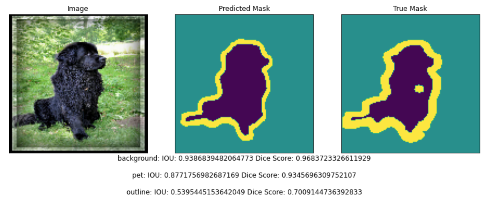

# U-Net for Image Segmentation

This project demonstrates the implementation of a U-Net architecture for semantic image segmentation. U-Net is a fully convolutional network with skip connections between the encoder and decoder stages, allowing it to capture both fine-grained details and high-level context in images. This structure is particularly effective for segmentation tasks, where precise boundary detection is crucial.

## Table of Contents
- [Overview](#overview)
- [Dataset](#dataset)
- [Architecture](#architecture)
- [Setup and Usage](#setup-and-usage)
- [Results](#results)
- [Future Improvements](#future-improvements)
- [References](#references)

## Overview

In this project, we:
1. Build and train a U-Net model from scratch.
2. Apply it to the Oxford-IIIT Pets dataset for segmentation.
3. Generate segmentation masks to classify each pixel of an input image as part of the background, foreground, or object outline.

This notebook guides you through implementing each part of the network, from the encoder and decoder to applying skip connections between layers.

## Dataset

We use the [Oxford-IIIT Pets dataset](https://www.robots.ox.ac.uk/~vgg/data/pets/) for training. This dataset includes pet images, class labels, segmentation masks, and head region-of-interest data. For this project, only images and segmentation masks are used.

The dataset is available through TensorFlow Datasets, making it easy to download and integrate directly into the notebook. The segmentation masks are provided in versions 3 and above. The downloaded dataset is stored in a dictionary named `dataset`, with additional metadata assigned to a variable named `info`.

## Architecture

The U-Net model follows a symmetrical structure:
1. **Encoder**: Downsampling layers capture contextual information at multiple resolutions.
2. **Decoder**: Upsampling layers recover spatial details. Skip connections from encoder to decoder help preserve fine details.
3. **Skip Connections**: Pass information from each encoder layer to its corresponding decoder layer, helping to retain essential low-level details for more accurate segmentation.

The fully convolutional nature of U-Net allows it to process images of different sizes and produce high-resolution segmentation masks.

## Setup and Usage

1. **Requirements**: Install the necessary packages using the following commands:
   ```python
   pip install -r requirements.txt
   ```
2. **Run the Notebook**: Open and run each cell in the notebook to:
   - Load and preprocess the dataset.
   - Build the U-Net model from scratch.
   - Train the model on the Oxford-IIIT Pets dataset.
   - Evaluate the model’s performance and generate segmentation masks.

3. **Training**: The model is trained to segment pet images, and outputs segmentation masks that label each pixel as part of the pet, background, or edge.

4. **Evaluation**: The model’s accuracy in pixel-wise classification can be visualized by comparing predicted masks with ground truth masks provided in the dataset.

## Results

After training, the U-Net model produces segmentation masks that accurately classify image regions. Visualizations show the model's performance in distinguishing between foreground, background, and object outlines, even in complex pet shapes.

### Example Output:


## Future Improvements

1. **Model Optimization**: Explore model optimizations such as data augmentation, batch normalization, or dropout to further improve accuracy.
2. **Hyperparameter Tuning**: Experiment with different learning rates, batch sizes, and epochs for potentially better results.
3. **Different Datasets**: Test the model’s performance on other segmentation datasets to assess generalization.

## References

- Ronneberger, O., Fischer, P., & Brox, T. (2015). U-Net: Convolutional Networks for Biomedical Image Segmentation. In *Proceedings of the International Conference on Medical Image Computing and Computer-Assisted Intervention*.
- [Oxford-IIIT Pets Dataset](https://www.robots.ox.ac.uk/~vgg/data/pets/)
